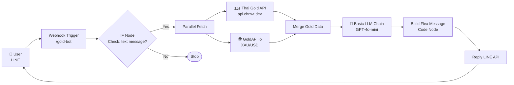

# 🏆 Gold Knowledge Chatbot

> AI Chatbot สำหรับให้ความรู้และข้อมูลราคาทองคำแบบ real-time ผ่าน LINE Official Account

---

## 📌 ปัญหาที่แก้ไข (Problem Statement)

### WHO
นักลงทุนมือใหม่ และผู้ที่สนใจลงทุนทองคำ

### WHAT
ผู้ใช้งานขาดความรู้พื้นฐานเกี่ยวกับทองคำ เช่น
- ราคาทอง (ทองรูปพรรณ / ทองแท่ง / ทองโลก)
- วิธีลงทุนและเปรียบเทียบรูปแบบการลงทุน
- การวิเคราะห์แนวโน้มราคาเบื้องต้น

ข้อมูลกระจายอยู่หลายแหล่ง ทำให้ค้นหาและตัดสินใจยาก

### WHEN
เกิดขึ้นบ่อยเมื่อ
- ผู้ใช้งานต้องการศึกษาการลงทุนทองอย่างรวดเร็ว
- ราคาทองมีการเปลี่ยนแปลงและต้องตัดสินใจเร่งด่วน

### HOW MUCH
ผู้ใช้เสียเวลาในการค้นหาข้อมูลจากหลายเว็บไซต์ และอาจตัดสินใจลงทุนผิดพลาดจากข้อมูลที่ล้าสมัย

---

## 💡 วิธีแก้ไข (Proposed Solution)

**Gold Knowledge Chatbot** — ระบบ AI Chatbot บน n8n ที่:

- ✅ ตอบคำถามเกี่ยวกับทองคำด้วย AI (GPT-4o-mini)
- ✅ แสดงราคาทองไทยและทองโลกแบบ real-time
- ✅ ส่งผลลัพธ์เป็น Flex Message สวยงามบน LINE
- ✅ มีปุ่มเชื่อมต่อ Gold Dashboard (LIFF App)

---

## 🏗️ สถาปัตยกรรมระบบ (System Architecture)



---

## 🔧 Tech Stack

| Component | Technology |
|-----------|-----------|
| Workflow Engine | [n8n](https://n8n.io) |
| AI Model | GPT-4o-mini (OpenAI) |
| LINE Integration | LINE Messaging API + Flex Message |
| Thai Gold Price | [Thai Gold API](https://api.chnwt.dev/thai-gold-api/latest) (Free, no key) |
| World Gold Price | [GoldAPI.io](https://goldapi.io) (XAU/USD) |
| Frontend (Optional) | LINE LIFF App (Gold Dashboard) |

---

## ⚡ Quick Start

### 1. เตรียม Prerequisites

| รายการ | แหล่งสมัคร |
|--------|-----------|
| n8n (Cloud หรือ Self-hosted) | [n8n.io](https://n8n.io) |
| OpenAI API Key | [platform.openai.com](https://platform.openai.com) |
| LINE Channel Access Token | [developers.line.biz](https://developers.line.biz) |
| GoldAPI.io Token | [goldapi.io](https://goldapi.io) |

### 2. นำเข้า Workflow

```bash
# ใน n8n: Workflows > Import from File
# เลือกไฟล์ GoldChatBot_Project.json
```

### 3. ตั้งค่า Credentials

คัดลอกไฟล์ `.env.example` เป็น `.env` และกรอกค่าตามนี้:

```bash
cp .env.example .env
```

จากนั้นอัปเดตค่าในแต่ละ Node ของ Workflow ตามตารางด้านล่าง:

| Node | ค่าที่ต้องกำหนด |
|------|---------------|
| `OpenAI Chat Model` | OpenAI API Key (ตั้งใน n8n Credentials) |
| `Reply LINE` | LINE Channel Access Token (Authorization Header) |
| `Get World Gold` | GoldAPI.io Token (x-access-token Header) |
| `Build Flex Message` | LIFF URL (Optional, สำหรับปุ่ม Dashboard) |

### 4. ตั้งค่า LINE Webhook

1. คัดลอก Webhook URL จาก n8n Node `Webhook`:
   ```
   https://<your-n8n-instance>/webhook/gold-bot
   ```
2. ไปที่ LINE Developers Console > Messaging API > Webhook settings
3. วาง URL และกด **Verify**
4. เปิด **Use webhook**, ปิด Auto-reply

### 5. เปิดใช้งาน

- เปิด Workflow ใน n8n และกด **Activate**
- ทดสอบโดยส่งข้อความใน LINE เช่น `"ราคาทองวันนี้เท่าไหร่?"`

> 📖 ดูคู่มือการติดตั้งแบบละเอียดได้ที่ `Gold_ChatBot_Installation_Guide.docx`

---

## 📁 โครงสร้างไฟล์

```
gold-chatbot/
├── GoldChatBot_Project.json        # n8n Workflow (import ไปใน n8n)
├── .env.example                    # ตัวอย่างตัวแปรที่ต้องกำหนด
├── README.md                       # ไฟล์นี้
└── Gold_ChatBot_Installation_Guide.docx  # คู่มือติดตั้งแบบละเอียด
```

---

## 🔑 Environment Variables

ดูรายละเอียดทั้งหมดได้ที่ไฟล์ `.env.example`

> **หมายเหตุ:** n8n ไม่ได้ใช้ `.env` โดยตรงสำหรับ Workflow — ค่าเหล่านี้ต้องกรอกใน n8n Credentials หรือ Node settings โดยตรง ไฟล์ `.env.example` ใช้เป็น reference สำหรับผู้ดูแลระบบ

---

## ⚠️ ข้อควรระวัง

- **ห้ามเปิดเผย** LINE Channel Access Token และ OpenAI API Key ใน public repository
- ราคาทอง real-time ขึ้นอยู่กับ uptime ของ API ภายนอก
- GPT-4o-mini มีค่าใช้จ่ายตาม token ที่ใช้ ควรตั้ง usage limit ใน OpenAI Dashboard
- GoldAPI.io แผนฟรีมี request limit ต่อเดือน

---

## 📞 ติดต่อและสนับสนุน

- n8n Docs: https://docs.n8n.io
- LINE Messaging API: https://developers.line.biz/en/docs/messaging-api/
- OpenAI Docs: https://platform.openai.com/docs
- GoldAPI.io: https://www.goldapi.io/dashboard
